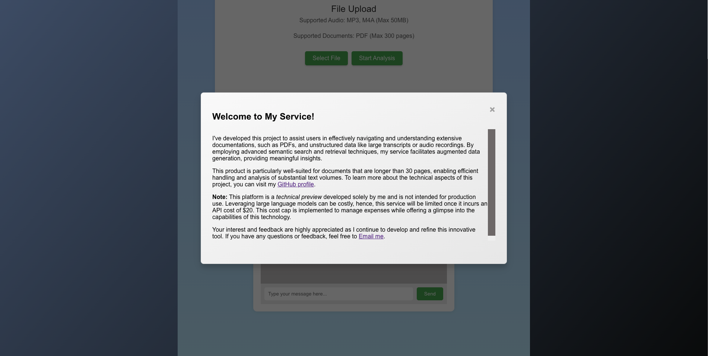
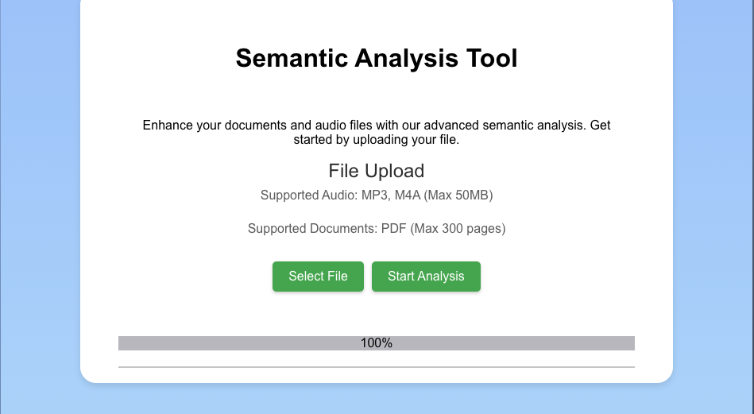
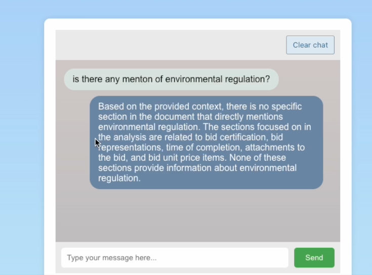
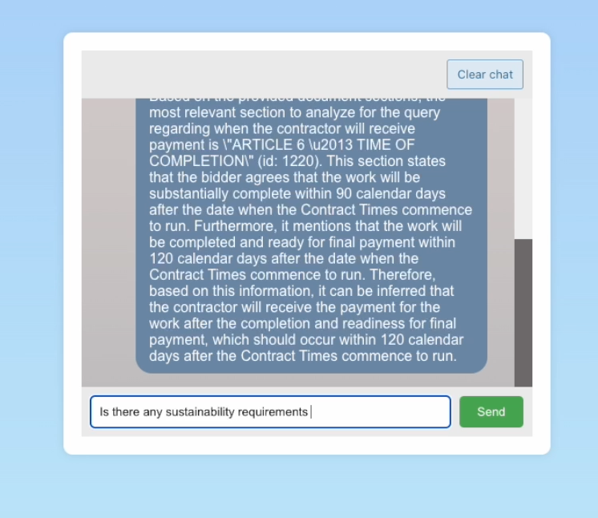

# Contextual Conversation Web App

## Overview

Our web application is an innovative solution designed to analyze and comprehend extensive documentation and audio files. By converting uploads into embeddings and storing them in a vector database, the platform offers a rich and contextual chat experience, allowing users to query and receive responses that are contextually relevant to the uploaded content.

## Features

- **Document Upload:** Users can upload PDF documents for analysis, limited to a maximum of 300 pages.
- **Audio Upload:** The application accepts MP3 and M4A audio files, limited to 50MB in size.

- **Semantic Analysis:** Through natural language processing, the app analyzes the text and audio to provide in-depth insights.
- **Contextual Chat:** Leveraging embeddings and vector databases, the chat feature understands the context of user queries to deliver pertinent information.

- **Cognito Integration:** Ensures secure authentication and session handling for users.
- **Responsive UI:** The frontend is designed to be responsive and user-friendly, facilitating ease of interaction with the application.

## Technical Components

### Frontend

- **FileUpload:** A React component that allows users to upload files and displays upload progress.
- **ChatInterface:** A messaging interface where users can interact with the system, and receive contextual information derived from their uploaded content.
- **IntroModal:** An introductory pop-up that outlines the app's features and guides first-time users.

### Backend

- **Audio Processing:** Splits and transcribes audio files, then uploads the resulting embeddings to a database.
- **PDF Processing:** Extracts text from PDFs, processes the content, and uploads the embeddings to a database.
- **Authentication:** Utilizes AWS Cognito for managing user authentication and sessions.
- **Chat Query Processing:** Converts chat queries into embeddings and compares them with the document vectors to provide contextually relevant responses.
- **File Management:** Handles secure file operations, ensuring files are processed and stored in a temporary secure environment, typically `/tmp` in AWS Lambda.

## Getting Started

### Prerequisites

- Node.js and npm for the frontend
- Python 3.x, pip, and virtualenv for the backend
- AWS account with Cognito and Lambda configured
- OpenAI API key for semantic analysis

### Installation

1. **Clone the Repository:** Get a copy of the source code on your local machine.
2. **Install Frontend Dependencies:** Navigate to the frontend directory and run `npm install`.
3. **Install Backend Dependencies:** Set up a Python virtual environment, activate it, and run `pip install -r requirements.txt`.
4. **Environment Configuration:** Define environment variables for AWS services and OpenAI credentials. This includes the Cognito User Pool, Client ID, and your OpenAI key.
5. **Database Setup:** Ensure the vector database is set up with the appropriate schema on Supabase or a similar platform.
6. **Start the Backend Server:** Run the Flask server which handles the file processing and chat service.
7. **Launch the Frontend:** Execute `npm start` to run the React application.

## Usage

- **User Authentication:** Sign in using AWS Cognito to secure your session.
- **Uploading Files:** Select and upload your document or audio file through the FileUpload component. The upload progress will be displayed.
- **Starting a Chat:** Once your file is uploaded, navigate to the ChatInterface. Here you can type in your queries and the application will provide responses based on the context of your uploaded content.
- **Exploring the App:** Use the IntroModal to get a walkthrough of the application's capabilities and features.

## Contribution Guidelines

Contributions are what make the open-source community such an amazing place to learn, inspire, and create. Any contributions you make are greatly appreciated.

If you have a suggestion that would make this better, please fork the repo and create a pull request. You can also simply open an issue with the tag "enhancement".

Don't forget to give the project a star! Thanks again!

1. Fork the Project
2. Create your Feature Branch (`git checkout -b feature/AmazingFeature`)
3. Commit your Changes (`git commit -m 'Add some AmazingFeature'`)
4. Push to the Branch (`git push origin feature/AmazingFeature`)
5. Open a Pull Request

## Support and Contact

If you encounter any problems or have any questions, please contact ah2324@cornell.edu

## License

Distributed under the MIT License. See LICENSE for more information.

*This README assumes that you have a basic understanding of React, Node.js, Python, Flask, AWS, and OpenAI. It also assumes that you are familiar with virtual environments in Python for dependency management. Adjust the documentation according to the actual environment and dependencies of your project.*
